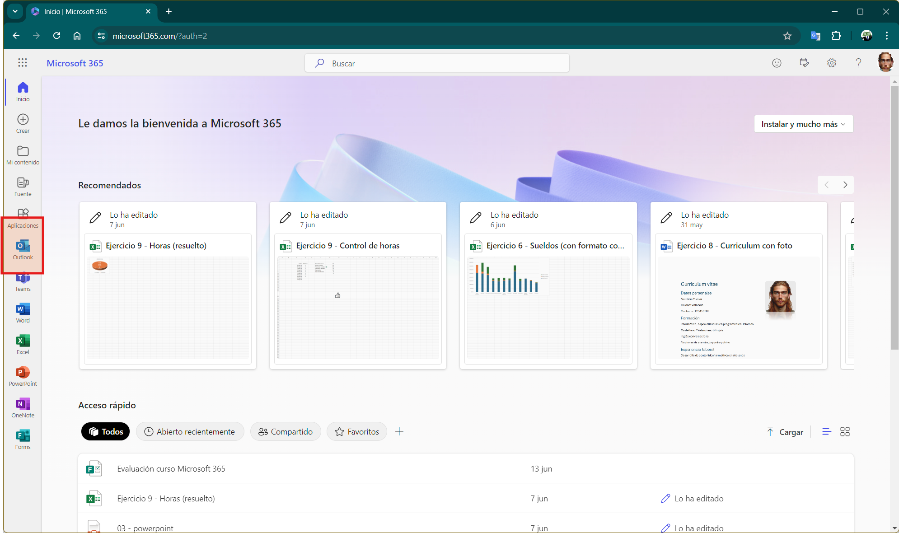
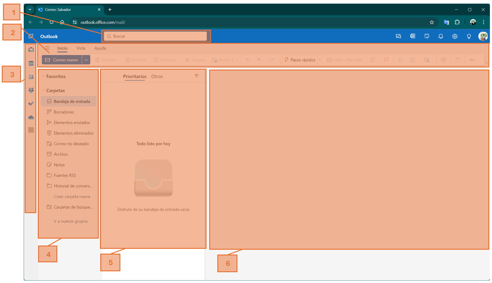
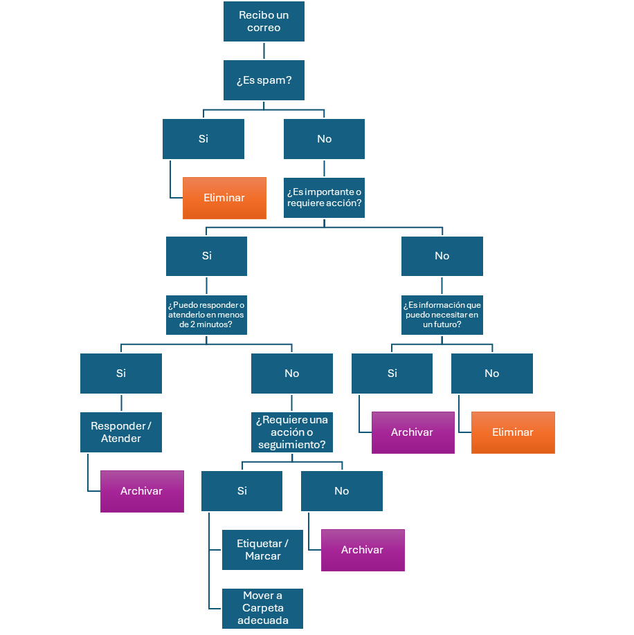
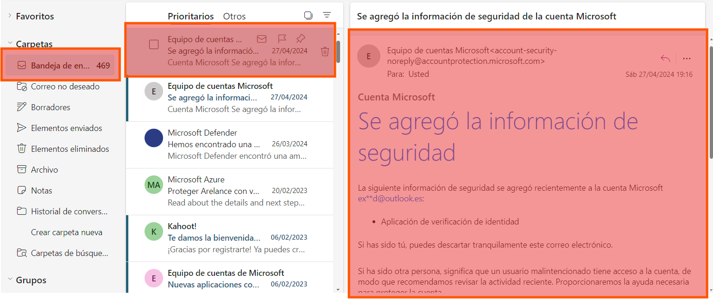
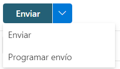
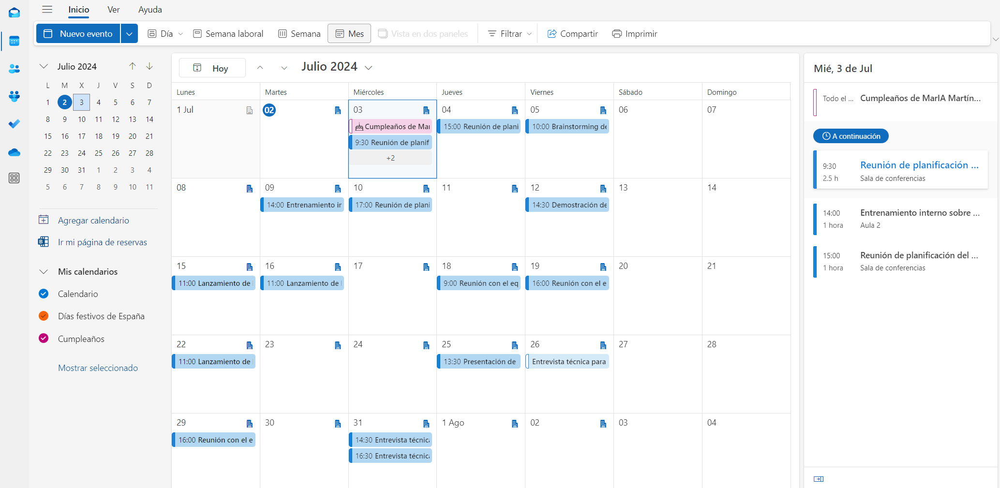
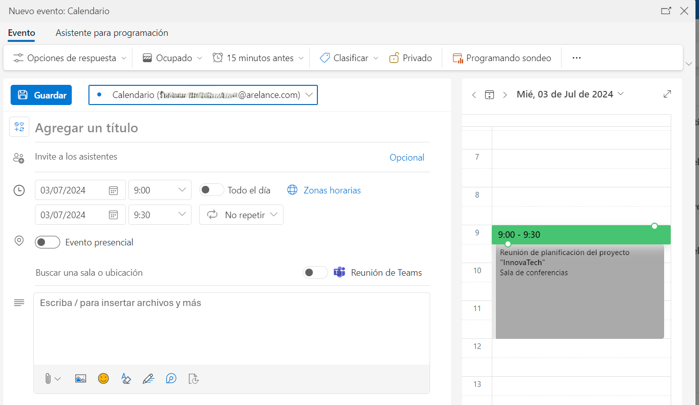
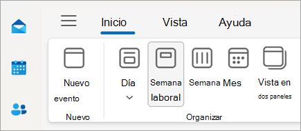
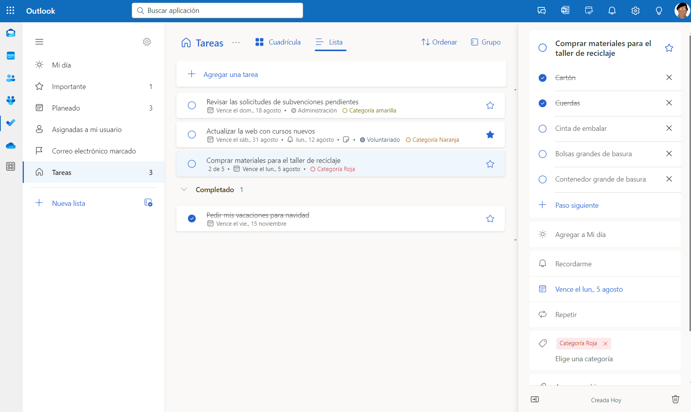

  4. Outlook

[TOC]

---

# Outlook

## Introducción

**Outlook** es una aplicación de correo electrónico y gestión de información personal desarrollada por Microsoft. Tiene las siguientes funciones principales:

- **Correo electrónico**: Outlook te permite enviar, recibir y organizar correos electrónicos. Puedes configurar múltiples cuentas de correo y acceder a ellas desde una sola interfaz.
- **Calendario**: El calendario de Outlook te ayuda a programar reuniones, eventos y recordatorios. Puedes compartir tu calendario con otros usuarios y compañeros de trabajo.
- **Contactos**: Puedes almacenar y administrar tus contactos en Outlook. Esto facilita el envío de correos electrónicos y la programación de reuniones.

Outlook es una herramienta integral para la comunicación, la organización y la administración de tu tiempo, ya sea dentro del ámbito profesional o personal.

## Iniciar Outlook

Para iniciar Outlook tenemos muchas opciones, veremos las más simples:

- Desde cualquier navegador, acceder directamente a https://outlook.office.com. Si no tenemos la sesión iniciada nos pedirá nuestras credenciales para acceder.
- Desde https://portal.office.com, en la barra lateral izquierda donde están todas las aplicaciones, hacemos clic sobre Outlook.
  

---

## Elementos de la pantalla principal

> [!NOTE]
>
> La vista de las aplicaciones online como Outlook suelen cambiar muy a menudo y es posible que haya pequeños cambios desde que se realizó el manual (noviembre 2024) a la versión que tengas actualmente.

Una vez entramos a la aplicación, veremos la siguiente pantalla principal:

Destacando las siguientes zonas numeradas:

1. **Cuadro de búsqueda:** Escriba aquí qué desea buscar, como el nombre de una persona cuyos mensajes desea encontrar o texto para encontrar un mensaje en particular. También se pueden añadir filtros más complejos como buscar en un rango de fechas concreto, asuntos, estado de lectura, etc.
2. **Cinta de opciones:** Es similar a lo visto en todas las aplicaciones de Office. Contiene los comandos y acciones más comunes, de una forma rápida y accesible. Los botones están agrupados en "Grupos" y los grupos en "Pestañas".
3. **Accesos directos:** Contiene accesos para moverte entre Outlook, calendario, contactos, grupos, tareas y OneDrive.
4. **Lista de carpetas:** Incluye las carpetas de tu bandeja de entrada y de Favoritos. Puede incluir otras carpetas, como carpetas archivadas. Puedes expandir y contraer carpetas en esta vista seleccionando los iconos de triángulo junto a los nombres de las carpetas. Al seleccionar una carpeta, se mostrará su contenido en la siguiente zona.
5. **Lista de mensajes de la carpeta actual:** Cada entrada de la vista de lista contiene información adicional, como por ejemplo, cuántos mensajes hay en una conversación y cuántos están sin leer, o si hay datos adjuntos, un marcador o una categoría asociados a algún mensaje de la conversación. Una conversación puede tener uno o más mensajes. Cuando se selecciona una conversación, puede eliminarla, agregar una marca o agregar una categoría seleccionando los iconos. En la parte superior de la vista de lista hay filtros que puedes seleccionar para buscar rápidamente mensajes que no se han leído, que incluyen su nombre en las líneas Para o CC, o que se han marcado. Además de los filtros, verás el nombre de la carpeta que estás viendo y la vista que ha seleccionado.
6. **Panel de lectura:** Donde se visualiza la conversación que has seleccionado en la lista de mensajes. En la cinta de opciones tendrás botones para interactuar con el correo seleccionado. Podrás responder, archivar, borrar, etc. 

​	

---

# Correo electrónico

El correo electrónico es uno de los pilares fundamentales de Outlook. En esta sección, exploraremos cómo crear, enviar, leer y gestionar correos electrónicos de manera eficiente. Aprenderás a redactar mensajes, adjuntar archivos y organizar tu bandeja de entrada. 

## Crear y enviar correos electrónicos

**Outlook**, como parte de la suite **Office 365**, es una herramienta esencial para la comunicación y la organización. Aprender a redactar y enviar correos electrónicos eficientemente es fundamental para cualquier usuario. En esta sección, exploraremos los pasos básicos para crear y enviar mensajes, así como algunos consejos para optimizar tu experiencia con Outlook.

**1. Iniciar un nuevo correo**

Para redactar un nuevo correo electrónico, sigue estos pasos:

1. Abre **Outlook** y pulsa el botón de <kbd>Correo nuevo</kbd>. . Se mostrará una ventana como la siguiente:
   
2. En el campo <kbd>Para</kbd>, ingresa la dirección de correo electrónico del destinatario principal.
3. Si necesitas enviar copias a otros destinatarios, utiliza los campos <kbd>CC</kbd> (con copia) o <kbd>CCO</kbd> (con copia oculta).

**2. Asunto y cuerpo del correo**

El asunto y el cuerpo del correo son esenciales:

- **Asunto**: Escribe un asunto breve pero descriptivo que resuma el contenido del correo.
- **Cuerpo del mensaje**: Aquí es donde va el mensaje principal que vas a enviar. 

**3. Adjuntar archivos**

Si deseas enviar archivos junto con el correo:

1. Ve a la pestaña `Insertar` > `Adjuntar archivo`.

   

2. Se abrirá un desplegable para adjuntar archivos que tengamos en nuestro equipo, en OneDrive, etc. Si pulsamos en `Nuestro equipo` se abrirá una ventana para seleccionar archivos que tengamos localmente en nuestro PC. 

> [!TIP]
>
> También podemos arrastrar y soltar archivos directamente sobre el cuerpo del correo electrónico para adjuntarlos.🤏📄

**4. Revisar y enviar**

Antes de enviar el correo:

1. **Revisa el contenido**: Verifica que el texto sea claro y sin errores.
2. **Adjuntos**: Asegúrate de que los archivos adjuntos sean los correctos.
3. **Enviar**: Haz clic en <kbd>Enviar</kbd> para que el correo se entregue al destinatario.

> [!IMPORTANT]
>
> 🚨 **MUY IMPORTANTE** 🚨
>
> Cuando envías un correo electrónico **ya no hay vuelta atrás**, por lo que es sumamente importante que lo revises muy bien antes de enviarlo, que no tenga errores y si tenías que adjuntar archivos, que se hayan adjuntado y que sea el correcto. Un fallo muy común es olvidarse de adjuntar el archivo que había que enviar.

---

## Gestión del correo electrónico

### Carpetas

El primer paso para revisar y leer los correos pendientes, será seleccionar la carpeta adecuada. Las carpetas que tengan correos sin leer aparecerán en negrita y además a la derecha aparecerá el número de correos sin leer que tienes en esa carpeta. 

Las carpetas básicas son:

- **Bandeja de entrada:** Aquí llegarán todos los correos nuevos por defecto. Intenta mantener la bandeja de entrada limpia (no como en la captura 🤯).
- **Correo no deseado:** Los mensajes sospechosos de ser spam o phishing, Outlook los moverá aquí automáticamente. Se borran automáticamente cada 10 días. Es conveniente que los revises por si algún correo se mueve aquí por error.
- **Borradores:** Los correos que estés redactando se guardarán aquí temporalmente hasta que los envíes. Cuando los envíes se moverán a <kbd>Elementos enviados</kbd>.
- **Elementos enviados:** Almacena copias de los correos que has enviado. Útil para verificar si un mensaje se entregó correctamente. 
- **Elementos eliminados:** Es como una papelera. Todo lo que borres se mueve a esta carpeta. Se eliminarán definitivamente de forma automática en 30 días. Se puede vaciar manualmente cuando quieras, como la papelera de Windows.
- **Archivo:** Aquí es donde podrás mover todo el correo que ya hayas leído o revisado pero no quieras borrar, manteniendo así la **bandeja de entrada** limpia. Los correos no se archivarán automáticamente, tu decides si quieres archivar un correo o no.
- **Notas:** Puedes usar las notas para anotar preguntas, ideas, recordatorios y cualquier cosa que normalmente escribirías en papel. 
- **Historial de conversaciones:** Inicialmente estaba destinada a los mensajes de chat de **Skype for Business**, ahora puede contener correos electrónicos normales y es opcional en su uso. Si deseas ocultarla, puedes hacerlo desde la configuración de **Outlook**.
- **Crear carpeta nueva:** Puedes crear tus propias carpetas para organizar el correo de manera más eficiente y personalizada. Por ejemplo, podrás crear una carpeta llamada "Bancos" para almacenar todo el correo referente a tu entidad bancaria.

> [!TIP]
>
> Una manera eficiente de manejar tus correos, es mantener siempre tu bandeja de entrada limpia. 
>
> 

### Correos

Una vez seleccionada la carpeta, se nos mostrará en el panel de lectura todos los correos de esa carpeta. De la misma forma al seleccionar un correo, se nos mostrará en el panel de lectura para poder leerlo.

> [!TIP]
>
> Los correos no leídos se nos mostrarán en negrita. Una vez seleccionados y mostrados en el panel de lectura, se considerarán como correos leídos. Esta información es para nosotros y el remitente no sabrá si hemos leído el correo o no. Para ello el remitente deberá enviarlo con acuse de recibo.

En la parte superior derecha tenemos accesos directos a las acciones más comunes a realizar sobre un correo electrónico:

En orden son:

- **Responder:** enviarás un correo electrónico solo al remitente original. Es útil cuando deseas responder directamente a la persona que envió el mensaje, independientemente de si había más destinatarios en el correo.

- **Responder a todos:** Se envía un correo a todos los destinatarios originales, incluido el remitente.

- **Reenviar:** Se reenvía el correo a otra persona o grupo.

- **Más acciones:** Otras acciones útiles como borrarlo, marcarlo como no leído, denunciar el contenido, bloquear el remitente, imprimirlo, etc.

  

Todas éstas acciones las encontrarás también en la cinta de opciones:

**Simplificada:**

**Clásica:**

> [!TIP]
>
> Puedes cambiar el diseño de la cinta de opciones, en el botón que hay en la derecha de la cinta.
>
> 

### Posponer y programar envío

Outlook posee muchas opciones avanzadas que no veremos, pero hay dos muy simples y útiles en el día a día.

**Posponer**

La encontrarás en la cinta de opciones al seleccionar un correo electrónico. Al pulsarlo se abre un desplegable con unos tiempos que determina **cuándo volverá a aparecer el correo en la bandeja de entrada**. Desaparece de la bandeja de entrada y se mueve a una nueva carpeta llamada "Pospuesto". El correo permanecerá ahí el tiempo que hayamos elegido (también se puede seleccionar una fecha y hora concreta). Cuando pase el tiempo establecido, se moverá de nuevo a la bandeja de entrada como si fuese un correo nuevo.

Esto es muy útil para no **ocuparnos por ahora** de un correo ya sea porque no es importante o porque por ahora no podemos darle solución, y así podamos mantener limpia la bandeja de entrada.

**Programar un envío**

Sirve para programar su entrega en una fecha y hora determinada en lugar de enviar el correo inmediatamente. El remitente no lo recibirá hasta la hora programada. Esta opción la encontrarás en un desplegable junto al botón de <kbd>Enviar</kbd>, en <kbd>Programar envío</kbd>.

Es muy útil por varias razones:

- Envías el correo en el momento óptimo, aumentando la probabilidad de que los destinatarios lo abran y se involucren.
- Evitas que tus correos queden sepultados en una larga lista de otros correos sin leer. Por ejemplo, es viernes noche, y sabes que el destinatario no va a leer el correo hasta el lunes por la mañana, pues lo programas y evitas que tu correo sea uno más entre muchos que se acumulen durante el fin de semana.
- Puedes "enviar" correos cuando estarás ocupado o fuera de tu horario laboral.
- Para enviar correos a personas en diferentes zonas horarias.
- Si programas un correo para dentro de 10 minutos (por ejemplo) siempre tendrás un tiempo para revisarlo o cambiarlo. Si lo envías inmediatamente no.
- Puedes adelantar trabajo y asegurar que no se te olvide. Por ejemplo, tienes que enviar una documentación a la asesoría dentro de 20 días. Si ya puedes hacerlo, puedes redactar el correo y dejarlo programado en lugar de tener que acordarte de enviarlo en una fecha determinada o enviarlo con demasiada antelación.

---

# Contactos

Los contactos en Outlook te permiten gestionar la información de las personas con las que te comunicas regularmente. Puedes agregar, editar y eliminar contactos según tus necesidades.

En la página principal de Outlook, en la barra de accesos directos de la izquierda, tenemos el botón de <kbd>Contactos</kbd>.

La sección de contactos en Outlook funciona como una agenda personalizada. En ella, puedes almacenar y gestionar información sobre las personas con las que te comunicas regularmente. 

Desde aquí podremos:

- **Agregar nuevos contactos**, con el botón <kbd>Nuevo contacto</kbd>.
- **Editar y actualizar** información, con el botón <kbd>Editar</kbd>.
- **Crear grupos** o categorías para mantener una organización más personalizada según tus preferencias. Por ejemplo, crear los grupos de "Recursos Humanos", "Marketing", o "Formación" y agregar a cada grupo los compañeros que los formen, para poder enviar un email o crear un evento en el calendario con todos los integrantes de un mismo grupo.

Es muy útil mantener nuestra lista actualizada, ya que nos ayudará a **enviar correos y crear eventos de calendario**, como veremos más adelante.

---

# Calendario

El calendario de Microsoft 365 es una herramienta esencial para organizar tus eventos, citas y recordatorios. Desde programar reuniones hasta establecer alertas, el calendario te ayuda a gestionar tu tiempo de manera eficiente.

## Acceso al Calendario

Puedes acceder al calendario a través de [Outlook en la web](https://outlook.office.com/calendar/), la aplicación de escritorio de Outlook, o la aplicación móvil de Outlook. Esto te permite ver y gestionar tus eventos desde cualquier dispositivo.

## Creación de Eventos

Para crear un evento o reunión, simplemente selecciona el día y la hora en el calendario y añade detalles como el título, la ubicación y una descripción. Puedes configurar recordatorios y establecer si el evento se repite.

### Invitación a Participantes

Para convertir el evento en una reunión, solo tienes que invitar a otras personas enviándoles una invitación directamente desde el calendario. Los invitados recibirán un correo electrónico con la invitación y podrán aceptar, rechazar o proponer una hora alternativa.

> [!TIP]
>
> Las invitaciones pueden ser obligatorias u opcionales. La diferenciación entre los tipos de invitaciones a los eventos permite ver al resto de participantes quienes son esenciales en la reunión para entender la importancia del evento.

### Establecer la duración y periodicidad

Selecciona la duración del evento (1 hora, 30 minutos, etc.). Si la reunión será recurrente, como una reunión semanal de equipo, configura la periodicidad (diaria, semanal, mensual, etc.).

## Configuración de recordatorios y notificaciones

Los recordatorios ayudan a los usuarios a no perder de vista sus próximos compromisos, avisándoles antes de que estos comiencen.

1. **Agregar recordatorios:** Al crear un evento, puedes configurar un recordatorio para que te avise minutos, horas o días antes del evento. Por ejemplo, puedes establecer un recordatorio 15 minutos antes de una reunión.
2. **Notificaciones de cambio:** Si el organizador hace algún cambio en el horario o los detalles de la reunión, los asistentes recibirán una notificación automática con la nueva información. Esto es útil para asegurarse de que todos estén al tanto de los cambios y eviten confusiones.

> [!tip]
>
> Usa los recordatorios con antelación suficiente para poder preparar los materiales o el espacio necesario, especialmente para reuniones importantes.

## Integración con Microsoft Teams

Una de las características clave del Calendario de Microsoft 365 es su integración con Microsoft Teams. Esto facilita la programación de reuniones virtuales directamente desde el calendario. Al crear una nueva reunión, puedes añadir un enlace de Teams, permitiendo que los participantes se unan fácilmente a la videollamada.

## Visualización y organización

El calendario ofrece diferentes vistas (diaria, semanal, mensual) para ayudarte a visualizar tu agenda. Además, puedes categorizar eventos por color, lo que facilita la identificación rápida de tipos de eventos o su prioridad.

## Sincronización y acceso móvil

Todos los cambios realizados en el calendario se sincronizan automáticamente en todos los dispositivos. Esto asegura que siempre tengas la información más actualizada, sin importar dónde te encuentres.

## Enfoque en la productividad

El uso efectivo del Calendario de Microsoft 365 puede mejorar significativamente la productividad. Algunas prácticas recomendadas incluyen:

- **Bloquear tiempo para tareas importantes**: Usa el calendario para reservar bloques de tiempo para tareas críticas, evitando interrupciones y gestionando mejor tu tiempo.
- **Programación de reuniones eficientes**: Al utilizar las opciones de invitación y la integración con Microsoft Teams, puedes asegurarte de que las reuniones se desarrollen sin problemas, con todos los recursos y documentos necesarios disponibles para los participantes.
- **Establecer recordatorios**: Configura recordatorios para eventos importantes para no olvidar ninguna cita o tarea clave.

El Calendario de Microsoft 365 es una herramienta poderosa para gestionar tu tiempo y mejorar la coordinación y comunicación en equipo. Con su integración con otros servicios de Microsoft, como Teams y Outlook, ofrece una experiencia fluida y eficiente para la planificación y gestión diaria.

## Establecer horarios

El apartado “Horas de trabajo y ubicación” en el Calendario de Outlook te permite definir cuándo y desde dónde trabajas. Puedes establecer tus horas laborales y especificar si estarás trabajando desde la oficina (o cual de ellas) o de forma remota. Esta configuración no solo te ayuda a organizar tu tiempo, sino que también facilita la coordinación con tus compañeros de trabajo, ya que ellos pueden ver tu disponibilidad y ubicación en tu tarjeta de perfil.

> [!IMPORTANT]
>
> Si invitas a un compañero/a a un evento de calendario fuera de su horario laboral establecido en su configuración de Outlook, recibirás una notificación indicando que el evento está fuera de su horario de trabajo. Esto no impide que envíes la invitación, pero ambos tendréis la información de que el evento está fuera del horario laboral. Esto ayuda a coordinar mejor los horarios dentro del equipo.

Se accede mediante el botón de <kbd>⚙️Configuración</kbd> en la esquina superior derecha. Ahí podrás configurar muchos aspectos de Outlook. 

Para ir directamente a `Configuración` > `Calendario` > `Horas de trabajo y ubicación` puedes ir a: https://outlook.office.com/mail/options/calendar/workSchedule

> [!TIP]
>
> No hay que tener miedo de entrar en una página de configuración, es más, deberías entrar siempre a mirar que hay. Posiblemente descubrirás opciones que no sabías que existían. 
>
> Solo hay norma, si no sabes qué estás haciendo, no toques 🫵.

## Compartición de calendarios y disponibilidad

Outlook facilita la compartición de tu calendario y permite a otros ver tu disponibilidad, sin mostrar detalles privados de los eventos o bien dando permiso a una persona para que pueda crear reuniones en tu nombre. Tu eliges el nivel de privacidad que quieres compartir y con quién lo quieres compartir.

1. **Compartir tu calendario:**

   - En la pestaña **Calendario**, selecciona **`Compartir`** y elige con quién deseas compartirlo. Puedes compartir con permisos de solo lectura o permitir que otros modifiquen eventos (esto es ideal para asistentes administrativos o coordinadores de equipo).

   

   > [!note]
   >
   > En la captura de ejemplo, le hemos dado permiso a que: 
   >
   > - Todas las personas de mi organización puedan ver los detalles de las reuniones (título, ubicación, todo) pero no pueden editar.
   > - A MarIA Martínez le hemos dado permiso para que vea algunos detalles de los eventos, como el título y la ubicación. Si una persona no pertenece a tu organización, solo podrás darle permisos limitados y de solo lectura.
   > - A Anabel hemos delegado en ella. Ella tiene permiso total para ver, crear, modificar y eliminar elementos del calendario. Pero además también puede crear reuniones y responder invitaciones en mi nombre.

   

2. **Establecer la visibilidad de los eventos:** Para cada evento, puedes definir si quieres que se muestre como "Disponible", "Trabajando en otro sitio", "Provisional", "Ocupado" o “Fuera de la oficina”. Esto permite a otros miembros ver tus tiempos de disponibilidad sin que tengan acceso al contenido del evento.

   

3. **Establecer etiquetas:** 

   - Puedes establecer etiquetas para clasificar las reuniones por los criterios que elijas, ya sea por prioridad o por tipos de reunión. Puedes administrar y crear tus propias etiquetas para clasificar tus reuniones de una forma personalizada.

   - Además, si tienes eventos privados, puedes marcarlos como tales para que el contenido permanezca oculto (pulsando el icono del candado).

     

     

> [!tip] 
>
> Compartir tu calendario y usar correctamente sus funciones con el equipo es muy útil para coordinar mejor la disponibilidad y reducir el tiempo invertido en organizar reuniones.

---

# Tareas

¿Alguna vez has sentido que tienes mil cosas por hacer y no sabes por dónde empezar? ¡No te preocupes! Las Tareas de Outlook están aquí para ayudarte. Son como tu lista de tareas pendientes digital, donde puedes anotar todo lo que necesitas hacer, desde enviar ese correo importante hasta recordar comprar leche.

Las Tareas de Outlook son súper útiles para mantenerte organizado. Puedes crear tareas, asignarles fechas de vencimiento, agregarles notas y hasta dividirlas en subtareas. Así, no se te escapa nada y puedes llevar un control de todo lo que tienes que hacer. Además, puedes marcarlas como completadas cuando las termines, lo cual siempre da gustito y una sensación de logro.

> [!TIP]
>
> 🏷️Es muy importante el uso de categorías para priorizar y categorizar las tareas. 
>
> 🧩Las tareas también se pueden dividir en subtareas más pequeñas.
>
> 🔔El uso de fechas límite y recordatorios nos ayudarán a que no se nos olviden las tareas.

## Diferencias entre Tareas y Eventos de Calendario

Aunque las Tareas y los Eventos de Calendario pueden parecer similares, tienen sus diferencias clave:

- **Tareas**: Son para cosas que necesitas hacer. No tienen una hora específica aunque pueden tener una fecha límite. Piensa en ellas como tu lista de cosas por hacer.
- **Eventos de Calendario**: Estos son para cosas que tienen una hora y fecha específica, como reuniones, citas o eventos. Son más como recordatorios de dónde y cuándo tienes que estar en algún lugar.

## Integración con otras aplicaciones de Microsoft 365

**Outlook**

Dentro de Outlook, las Tareas están perfectamente integradas. Puedes crear tareas directamente desde un correo electrónico. Por ejemplo, si recibes un correo con una solicitud importante, puedes convertirlo en una tarea con solo un par de clics. Además, puedes ver tus tareas en la barra lateral de Outlook, lo que facilita tener todo a la vista mientras gestionas tus correos.

**Calendario**

Aunque las Tareas y los Eventos de Calendario son diferentes, trabajan juntos para mantenerte organizado. Puedes ver tus tareas en el Calendario de Outlook, lo que te ayuda a planificar tu tiempo de manera más efectiva. Por ejemplo, si tienes una tarea con una fecha límite, aparecerá en tu calendario, recordándote que debes completarla antes de esa fecha.

**Planner**

Planner es una herramienta genial para gestionar proyectos en equipo. Puedes crear planes, asignar tareas a diferentes miembros y seguir el progreso. Lo mejor es que las Tareas de Outlook se pueden sincronizar con Planner. Así, cualquier tarea que te asignen en Planner aparecerá en tu lista de Tareas de Outlook. ¡Todo en un solo lugar!

