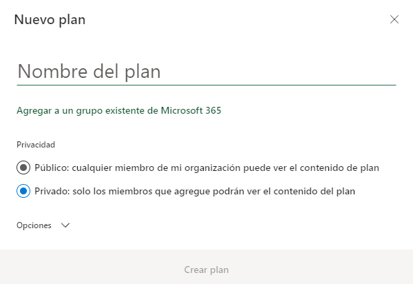
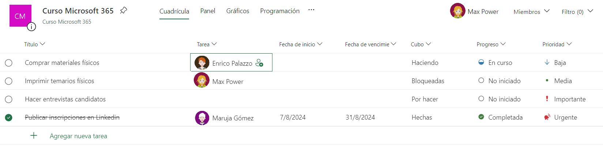
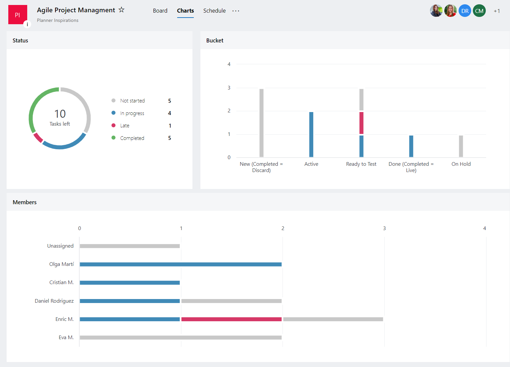
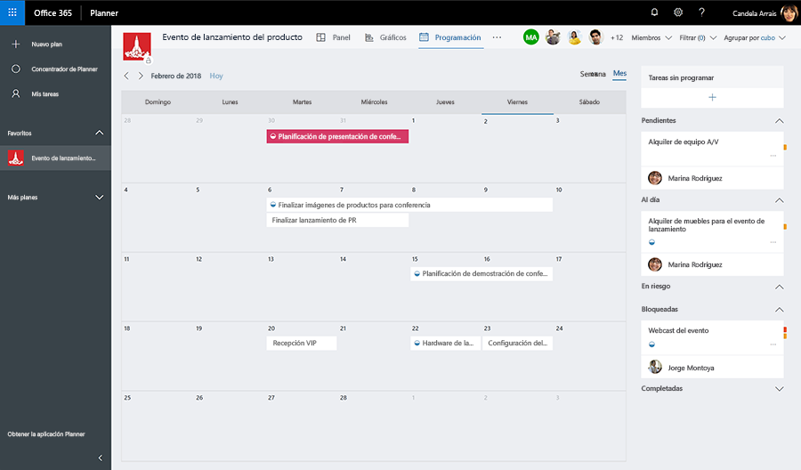

  6. Microsoft Planner

[TOC]

---

# Microsoft Planner

## Introducción

    

**Microsoft Planner** es una herramienta genial para organizar tareas y proyectos. Te ayuda a ti y a tu equipo a colaborar de manera eficiente. Con Planner, puedes crear planes, asignar tareas, compartir archivos y ver el progreso de todo. Es perfecta para cualquier cosa, desde tareas diarias hasta proyectos grandes.

Microsoft Planner es como un tablero de corcho digital donde puedes organizar tus tareas. Cada "plan" es como un proyecto con su propio tablero, y puedes mover las tareas según su estado, como si fueran notas adhesivas.

Con Planner en su PC, Mac o dispositivo móvil, podrá:

- Crear planes, asignar tareas y compartir archivos con otros usuarios.
- Organizar el trabajo en equipo y colaborar en proyectos de forma sencilla y visual.
- Chatear con otros usuarios para garantizar que todos estén al día de las últimas novedades.
- Realice un seguimiento del progreso de su equipo y manténgase al día de su trabajo desde cualquier lugar y con cualquier dispositivo.

## Iniciar la aplicación

Para empezar a  trabajar con Planner tiene varias opciones:

- 🌐Abrir la aplicación web en tu navegador, ya sea en Windows, MacOS o Linux: https://tasks.office.com/.
- 📱Instalar la aplicación móvil:
  - Android: https://play.google.com/store/apps/details?id=com.microsoft.planner&hl=es_419
  - iOS: https://apps.apple.com/es/app/microsoft-planner/id1219301037

Una vez abierta e iniciada la sesión con nuestra cuenta de Microsoft 365, veremos una pantalla como la siguiente:

## Cómo Crear un Nuevo Plan

Abre Microsoft Planner desde tu cuenta de Microsoft 365 y haz clic en <kbd>Crear un plan</kbd>. Ponle un nombre, elige si es público o privado, ¡y listo!

## Configurar el Plan

Después de crear el plan, puedes agregar una descripción, establecer permisos y personalizarlo según lo que necesite tu equipo.

> [!TIP]
>
> Si pulsas sobre el nombre del plan <kbd>Curso Microsoft 365 📌</kbd>, arriba en el centro, podrás editar el nombre, visibilidad e imagen de fondo del plan, entre otras cosas.

## Agregar miembros al plan

Si deseamos usar el plan de forma colaborativa con otros compañeros, deberemos añadir miembros al plan. En el botón <kbd>Miembros 🔽</kbd> , del menú superior derecho, podremos añadir miembros de nuestra organización a nuestro plan. De esta forma, el tablero estará compartido y todos sus miembros verán los cambios de forma sincronizada en todos los dispositivos que usen.

También así podremos asignarles tareas a los miembros de nuestro plan.

## Crear tareas

Dentro de cada plan, puedes crear **tareas**. Cada tarea puede tener un nombre, una descripción y se puede asignar a uno o más miembros del equipo.

Usando el botón <kbd>+ Agregar Tarea</kbd> podemos crear tareas.

La tarea básica puede constar de:

- **Un nombre**: Es lo mínimo requerido y es obligatorio para crearla. 
- **Una fecha de vencimiento**: Te enviarán notificaciones en fechas cercanas al vencimiento. Por defecto las tareas no tienen fecha de vencimiento.
- **Un miembro asignado**: Puedes asignar una tarea a un miembro del plan. Dicha persona recibirá una notificación de su asignación a la tarea, y cuando se haya terminado, podrá marcarla como realizada (ya veremos como).

Una vez creada, se puede hacer clic en ella y añadirle más características como:

- **Etiquetas**: Sirve para categorizar las tareas.
- **Progreso:** Para indicar si la tarea está `No iniciada`, `En curso` o `Completada`.
- **Prioridad:** Para indicar a los miembros de la importancia de dicha tarea. 
- **Fecha de inicio:** Para indicar cuando deberá empezar la tarea. Por defecto todas las tareas pueden iniciarse en cualquier momento.
- **Repetir:** Para indicar la periodicidad de la tarea. Por ejemplo, si es una tarea que se debe realizar cada día 25 de cada mes, desde aquí se puede hacer.
- **Notas:** Para agregar una descripción o cualquier nota extra.
- **Listas de comprobación:** Si la tarea tiene subtareas, se pueden agregar aquí como si fuera una lista de tareas a ir completando.
- **Archivos adjuntos:** Para adjuntar un archivo a la tarea y que cualquier miembro pueda acceder. Los archivos se pueden seleccionar desde OneDrive.
- **Comentarios:** Cualquier comentario que queramos hacer sobre la realización de la tarea.

Una vez creadas las tareas, se verán en el plan de la siguiente forma:

## Depósitos

Los **depósitos** (o cubos o *buckets*) son únicamente columnas dentro del tablero del plan. Esto permite ordenar las tareas en función de lo que necesitemos. Por ejemplo, se pueden crear un depósito por departamento que tenga la empresa o bien crear uno para cada día de la semana.

Una **organización muy extendida es crear depósitos por estado**. Ya por defecto viene un depósito llamado `Pendientes`. Tan solo deberíamos crear otro para `En proceso` y otro para `Completadas`. Así podemos ir moviendo las tareas de una columna a otra conforme se vayan realizando, tan solo arrastrándolas con el ratón. Adicionalmente se puede crear un depósito para las tareas Bloqueadas, que es cuando no está terminada por alguna razón que impide que se pueda completar, pudiendo tener una visión más global del plan.

> [!TIP]
>
> Se suele ver esta organización en inglés, con los nombres de `To Do`, `Doing` y `Done`.

## Vistas

Hay varias vistas para el plan que te ayudan a gestionar y organizar tus tareas de diferentes maneras, permitiéndote elegir la que mejor se adapte a tus necesidades en cada momento:

- **Panel**: La clásica vista de tablero Kanban, donde las tareas se muestran como tarjetas que puedes mover entre columnas. Es la que hemos visto en todas las capturas anteriores. Ideal para ver el flujo de trabajo y el estado de las tareas (como "Por Hacer", "En Proceso", "Completado"). Permite organizar y priorizar tareas visualmente.

- **Cuadrícula:** Una vista en forma de lista donde puedes ver todas las tareas en filas, como si fuera una hoja de Excel. Es útil para obtener una visión rápida y detallada de cada tarea, con todos sus detalles como fecha de vencimiento, asignados y estado. Se puede ordenar por cualquier columna, agrupando así las tareas por progreso, cubos, fechas, prioridad y demás.

  

- **Gráficos:** Una vista que muestra gráficos y diagramas sobre el progreso de tu plan. Perfecta para obtener una visión general rápida del estado del proyecto, viendo cuántas tareas están completadas, en proceso o pendientes. Los gráficos de pastel y barras ayudan a visualizar el progreso y las cargas de trabajo de los miembros del plan.

  

- **Programación:** Una vista tipo calendario que muestra las tareas según sus fechas de vencimiento. Útil para planificar y programar tareas en el tiempo, asegurando que no haya conflictos y que las fechas importantes sean visibles.

  

## Integración con otras herramientas de Microsoft 365

Microsoft Planner se integra a la perfección con otras herramientas de Microsoft 365, lo que facilita la gestión de tareas y la colaboración en equipo. A continuación, te explicamos cómo se conecta con el Calendario, Outlook y Teams.

### 1. Integración con el Calendario

- **Sincronización Automática**: Las tareas de Planner pueden sincronizarse con tu calendario de Outlook. Esto significa que las fechas de vencimiento de las tareas aparecerán en tu calendario, ayudándote a tener una visión completa de tus responsabilidades y tiempos.
- **Cómo Configurarlo**: Abre Planner, ve a tu plan y selecciona "Más" (los tres puntos), luego "Agregar plan al calendario de Outlook". Sigue las instrucciones para conectar tu plan con el calendario de Outlook.

### 2. Integración con Outlook

- **Crear Tareas desde Emails**: Puedes convertir correos electrónicos en tareas de Planner directamente desde Outlook. Esto es súper útil para asegurarte de que no se te olvide ninguna solicitud importante que recibas por correo.
- **Cómo Usarlo**: En Outlook, selecciona un correo electrónico y elige "Crear tarea en Planner" desde el menú de acciones. Esto abrirá un panel donde podrás configurar los detalles de la tarea.

### 3. Integración con Teams

- **Tablero de Planner en Teams**: Puedes agregar un tablero de Planner directamente a un canal de Teams. Esto permite que todos los miembros del equipo vean y actualicen las tareas sin salir de Teams.
- **Cómo Configurarlo**: En Teams, ve al canal donde quieres agregar el tablero, haz clic en el signo "+" para agregar una nueva pestaña, selecciona Planner y sigue las instrucciones para crear un nuevo plan o vincular uno existente.
- **Notificaciones y Chats**: Las tareas y actualizaciones en Planner pueden generar notificaciones en Teams, facilitando la comunicación. Además, puedes comentar y discutir las tareas directamente en Teams.

### Beneficios de la Integración

- **Mejor Coordinación**: Tener tus tareas sincronizadas con el calendario y Outlook asegura que todas tus responsabilidades estén centralizadas y accesibles desde cualquier plataforma.
- **Colaboración Simplificada**: Integrar Planner con Teams permite a todos los miembros del equipo ver el estado de las tareas y colaborar en tiempo real.
- **Mayor Productividad**: Estas integraciones ayudan a evitar la duplicación de esfuerzos y aseguran que todos estén al tanto de lo que se necesita hacer y cuándo.

Con estas integraciones, Microsoft Planner se convierte en una herramienta aún más poderosa y útil para gestionar tus proyectos y tareas diarias dentro del ecosistema de Microsoft 365.

