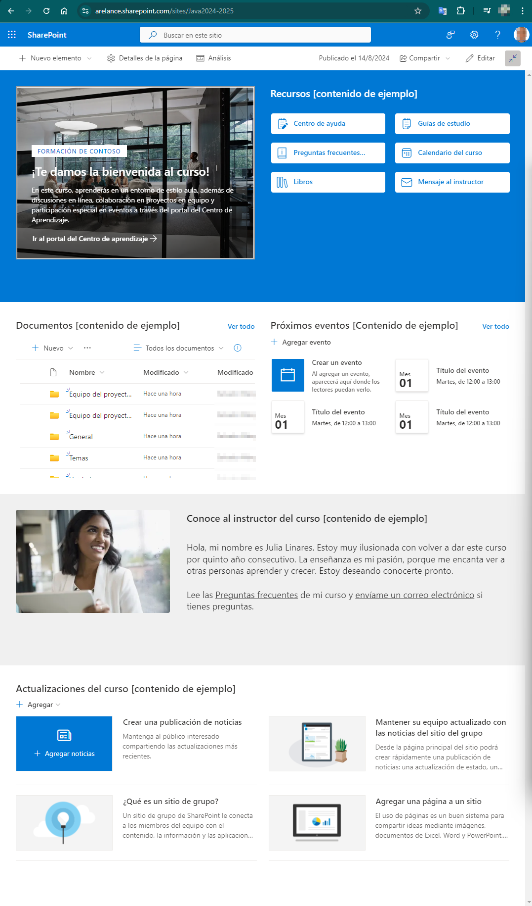

  7. SharePoint

[TOC]

---

# SharePoint

## Introducción a SharePoint

SharePoint es una herramienta de Microsoft 365 que permite a las empresas almacenar, organizar, compartir y acceder a información desde cualquier dispositivo con conexión a Internet. Es como un gran archivo digital donde puedes guardar documentos, fotos, videos y otros archivos importantes, pero con la ventaja de que todo está organizado y fácilmente accesible para quienes lo necesiten.

SharePoint te permite crear una especie de **"página web" interna** o portal donde puedes **reunir y organizar diferentes elementos de Microsoft 365** en un solo lugar, accesible para tu equipo o empresa.

Por ejemplo, en un sitio de SharePoint puedes:

- **Incrustar carpetas de OneDrive:** Puedes vincular y organizar carpetas o archivos de OneDrive para que todos puedan acceder a ellos directamente desde la página de SharePoint, sin necesidad de estar enviando enlaces por correo o Teams.
- **Mostrar eventos de calendario:** Puedes integrar calendarios de Outlook para que los miembros del equipo vean eventos importantes o fechas de reuniones directamente en la página.
- **Agregar tareas de Planner:** Puedes incluir listas de tareas o proyectos de Planner, lo que facilita el seguimiento de lo que hay que hacer.
- **Incorporar documentos de Word, Excel o PowerPoint:** Puedes incrustar y editar documentos de Word, hojas de Excel o presentaciones de PowerPoint directamente en la página.
- **Incluir conversaciones de Teams:** Puedes mostrar conversaciones o canales de Teams para que toda la comunicación relacionada con un proyecto esté centralizada.
- **Publicar noticias y anuncios:** Puedes usar la página para comunicar novedades, compartir documentos clave o cualquier otro contenido relevante para tu equipo.

> [!CAUTION]
>
> Este manual no pretende ser una guía paso a paso sobre cómo usar SharePoint, sino **ofrecerte una visión general de para qué sirve**, las posibilidades que ofrece y cómo puede integrarse en tu trabajo diario. La idea es que entiendas las capacidades de SharePoint, cómo centraliza y organiza recursos, y cómo puede facilitar la colaboración y gestión de contenidos dentro de tu equipo o empresa.

## Ventajas

**Centralización de Información**

Una de las mayores ventajas de SharePoint es que te permite **centralizar toda la información de tu equipo o empresa en un solo lugar**. En lugar de tener documentos dispersos en diferentes carpetas, correos electrónicos o aplicaciones, SharePoint organiza todo en sitios personalizados donde cada miembro del equipo puede acceder a lo que necesita. Esto reduce la confusión, evita la duplicación de archivos y facilita que todos trabajen con la misma información actualizada.

**Colaboración en tiempo real**

SharePoint está diseñado para facilitar la **colaboración entre equipos**, sin importar dónde se encuentren los miembros. Con SharePoint, varios usuarios pueden trabajar en el mismo documento al mismo tiempo, ver los cambios que otros hacen en tiempo real, y dejar comentarios o sugerencias. Esto es ideal para proyectos en los que la colaboración es clave, ya que todo el equipo puede contribuir sin tener que preocuparse por versiones desactualizadas o archivos perdidos.

**Seguridad y Control**

La seguridad es otra de las grandes fortalezas de SharePoint. Ofrece un **control detallado sobre quién puede acceder a qué información**. Puedes establecer permisos específicos para documentos, carpetas o sitios completos, asegurándote de que solo las personas correctas tengan acceso a información sensible. Además, SharePoint cumple con altos estándares de seguridad y cumplimiento normativo, lo que es especialmente importante para empresas que manejan datos críticos o confidenciales.

**Personalización**

SharePoint no es una solución rígida; puedes **personalizarlo para que se adapte exactamente a las necesidades de tu equipo o empresa**. Puedes crear sitios específicos para proyectos, departamentos o incluso para toda la empresa, cada uno con su propio diseño, estructura y contenido. Además, puedes agregar *web parts* (componentes) como calendarios, listas de tareas, documentos, y más, para que cada sitio ofrezca exactamente la funcionalidad que necesitas.

## Uso de SharePoint frente a otras herramientas de Microsoft 365

Es normal que si no conocemos SharePoint, inicialmente no le veamos el sentido, ya que estamos acostumbrados a trabajar colaborativamente con documentos, enlaces, correos y demás. Te explicaremos las diferencias respecto a otras herramientas para que lo vayas viendo más claro.

### SharePoint vs OneDrive

**OneDrive** es principalmente una herramienta de **almacenamiento personal** en la nube, ideal para guardar tus archivos y acceder a ellos desde cualquier lugar. Aunque puedes compartir documentos con otros, OneDrive está más orientado al uso individual. Por otro lado, **SharePoint** es una plataforma de **colaboración** que permite crear sitios donde puedes organizar, compartir y gestionar documentos de forma conjunta. Si necesitas colaborar en proyectos, trabajar en documentos con un equipo, o tener un lugar centralizado para la información de tu organización, SharePoint es la opción más adecuada.

### SharePoint vs Teams

**Microsoft Teams** es una herramienta de comunicación y colaboración en tiempo real que permite chatear, realizar videollamadas y colaborar en documentos directamente desde la plataforma. Teams es excelente para la **comunicación rápida y la colaboración en tiempo real**. Sin embargo, cuando se trata de **organizar y almacenar documentos**, o crear sitios para proyectos específicos, SharePoint se integra perfectamente con Teams, proporcionando un lugar estructurado donde se pueden almacenar y gestionar los archivos y recursos a largo plazo. En resumen, Teams y SharePoint se complementan: Teams para la comunicación diaria y SharePoint para la organización y gestión de contenidos.

### SharePoint vs Outlook

**Outlook** es una herramienta poderosa para **gestionar correos electrónicos y calendarios**, y aunque puedes compartir archivos a través de correos, no está diseñado para la colaboración en documentos o la organización de recursos a gran escala. SharePoint, en cambio, es ideal para **almacenar y gestionar documentos** a los que todos los miembros de un equipo pueden acceder sin necesidad de enviar correos electrónicos. En lugar de adjuntar documentos en Outlook, SharePoint permite que todos trabajen directamente desde un mismo lugar, asegurando que siempre se está utilizando la versión más actual del archivo.

**Cuándo usar cada herramienta**

- **OneDrive**: Cuando necesites **almacenamiento personal** de archivos o compartir documentos con unos pocos colaboradores.
- **Teams**: Para la **comunicación diaria** y la colaboración en tiempo real.
- **Outlook**: Para **gestionar correos y calendarios**, y enviar archivos de forma ocasional.
- **SharePoint**: Cuando necesites un **espacio centralizado** para organizar, almacenar y colaborar en documentos con tu equipo, gestionando permisos y creando sitios personalizados para proyectos o departamentos.

## Primeros pasos

Ahora que ya tenemos una visión global y conocemos las ventajas de SharePoint, vamos a ver de una forma muy básica como acceder, crear y administrar un sitio.

### Cómo acceder a SharePoint

1. Accede a [portal.office.com](http://portal.office.com) e **Inicia sesión en tu cuenta de Microsoft 365**. 
2. Busca el icono de SharePoint en el panel de aplicaciones. 
3. Al hacer clic en él, serás llevado a la página principal de SharePoint de tu organización, donde podrás ver los sitios a los que tienes acceso y buscar otros sitios o recursos dentro de tu organización.

### Navegando en un sitio de SharePoint

Una vez dentro de un sitio de SharePoint, **explora la interfaz para familiarizarte con los elementos clave**. La mayoría de los sitios tendrán una barra de navegación lateral donde puedes encontrar enlaces a diferentes secciones del sitio, como bibliotecas de documentos, listas, o calendarios. La página principal del sitio a menudo incluye **web parts** (componentes) como noticias, eventos, o documentos recientes. Navega por estas secciones para entender cómo está organizado el sitio y cómo puedes acceder a la información que necesitas.

### Cargando y compartiendo documentos

Para **cargar un documento en SharePoint**, dirígete a la biblioteca de documentos del sitio en el que deseas trabajar. Haz clic en el botón de **“Cargar”** y selecciona el archivo desde tu computadora. Una vez cargado, puedes **compartir el documento** con otros miembros del equipo haciendo clic en el botón de **“Compartir”**. Aquí, puedes elegir quién tendrá acceso al documento y qué tipo de permisos tendrán (como solo ver o editar). Esto facilita que otros colaboren en el mismo archivo sin necesidad de enviarlo por correo electrónico.

> [!NOTE]
>
> Piensa que en la mayoría de los casos, **tu no serás quién tenga que crear y/o administrar el sitio** de SharePoint. En un inicio solo tendrás que usarlo como si fuera una página web interna. Una vez que te familiarices con su uso, te será mucho más fácil crear y administrar tus propios sitios.

## Creación de un sitio básico

Para **crear un nuevo sitio en SharePoint**, comienza desde la página principal de SharePoint y haz clic en <kbd>**Crear sitio**</kbd>, arriba a la izquierda.

Lo primero que nos preguntará es si queremos crear un **sitio de grupo** o un **sitio de comunicación**.

- **Sitio de Grupo**: Diseñado para la **colaboración en equipo**, este tipo de sitio facilita el trabajo conjunto en proyectos. Incluye herramientas como bibliotecas de documentos, listas, y calendarios compartidos. Ideal para equipos que necesitan un **espacio privado centralizado** para organizar y colaborar en su trabajo diario.
- **Sitio de Comunicación**: Enfocado en **compartir información** con una audiencia más amplia, como toda la empresa o un departamento. Es ideal para publicar noticias, anuncios o información general. Ofrece un diseño más orientado a la comunicación y presentación de contenido, en lugar de colaboración activa en documentos.

> [!IMPORTANT]
>
> Elegir el **tipo de sitio adecuado** en SharePoint es crucial para asegurarse de que la estructura y las herramientas disponibles se alineen con el propósito y las necesidades específicas de colaboración o comunicación de tu equipo o audiencia.

Un asistente nos guiará durante el resto de pasos para crear el sitio inicialmente. Completa los campos necesarios, como el nombre del sitio y la descripción, y configura las opciones de privacidad y permisos.  

Una vez creado el sitio, podrás personalizarlo agregando bibliotecas de documentos, listas, calendarios y otros elementos según las necesidades de tu equipo o proyecto.

## Personalizar el sitio

SharePoint permite editar y adaptar todo el contenido creado inicialmente según las necesidades del equipo o de la información que quieras centralizar. En la **parte superior derecha** del sitio, encontrarás un botón que dice <kbd>**Editar**</kbd> o tiene un ícono de lápiz. Haz clic en este botón para entrar en el modo de edición.

**Modo Edición**

Una vez estás en modo de edición, verás una serie de **botones y opciones** en la parte superior del sitio y sobre las secciones. Estas herramientas te permiten realizar cambios de manera **gráfica e intuitiva**.

Puedes **agregar nuevos elementos**, como secciones, texto, imágenes o documentos, utilizando los botones disponibles. También puedes **modificar el diseño** del sitio arrastrando y soltando componentes, o ajustando las configuraciones de cada elemento.

**Guardar y Publicar Cambios**:

- Después de realizar las modificaciones deseadas, asegúrate de hacer clic en el botón <kbd>**Volver a publicar**</kbd> para guardar tus cambios. Esto provocará que todas las modificaciones sean visibles para otros usuarios.
- Si no quieres que los cambios sean visibles para todos los usuarios, puedes <kbd>**Guardar como un borrador**</kbd> y dejar para más adelante la publicación de dichos cambios.

## Recursos adicionales y siguientes pasos

**Dónde aprender más**

Para profundizar en el uso de SharePoint, explora los siguientes recursos:

- ⭐**Videos de Capacitación**: Plataformas como YouTube y el sitio web de Microsoft a menudo tienen videos útiles que muestran funciones específicas y casos de uso prácticos, así como cursos completos gratuitos y actualizados. [Haz clic aquí para hacer una búsqueda en Youtube](https://www.youtube.com/results?search_query=curso+de+sharepoint).
- **Centro de Aprendizaje de Microsoft**: Ofrece guías y tutoriales interactivos sobre SharePoint. Puedes acceder a él a través de [Microsoft Learn](https://learn.microsoft.com/).
- **Comunidad de Soporte de Microsoft**: Un foro donde puedes hacer preguntas y obtener respuestas de otros usuarios y expertos. Visítalo en [Microsoft Community](https://answers.microsoft.com/).
- **Udemy:** Es una plataforma de cursos online de pago y gratuitos. Existen [muchos cursos de SharePoint](https://www.udemy.com/courses/search/?q=sharepoint) (y de lo que quieras) que podrás encontrar a buen precio.

---

**Preguntas Frecuentes**

Aquí tienes algunas respuestas a dudas comunes:

- **¿Cómo puedo encontrar documentos rápidamente en SharePoint?** Utiliza la función de búsqueda en la parte superior del sitio para buscar palabras clave o filtros en las bibliotecas de documentos.
- **¿Qué hago si no tengo acceso a un sitio?** Contacta al administrador de SharePoint de tu organización para solicitar acceso o permisos adicionales.
- **¿Puedo trabajar sin conexión?** SharePoint requiere conexión a Internet para la mayoría de las funciones, pero puedes sincronizar documentos con tu dispositivo mediante la aplicación de sincronización de OneDrive para trabajar sin conexión.

---

**Conclusión y Próximos Pasos**

Ahora que tienes una visión general de SharePoint, puedes comenzar a explorar sus características en tu propio ritmo. Te recomendamos **practicar creando sitios**, cargando documentos y configurando permisos para familiarizarte con la plataforma. A medida que te sientas más cómodo, podrás descubrir más funcionalidades avanzadas y personalizar SharePoint para adaptarlo a tus necesidades específicas.

